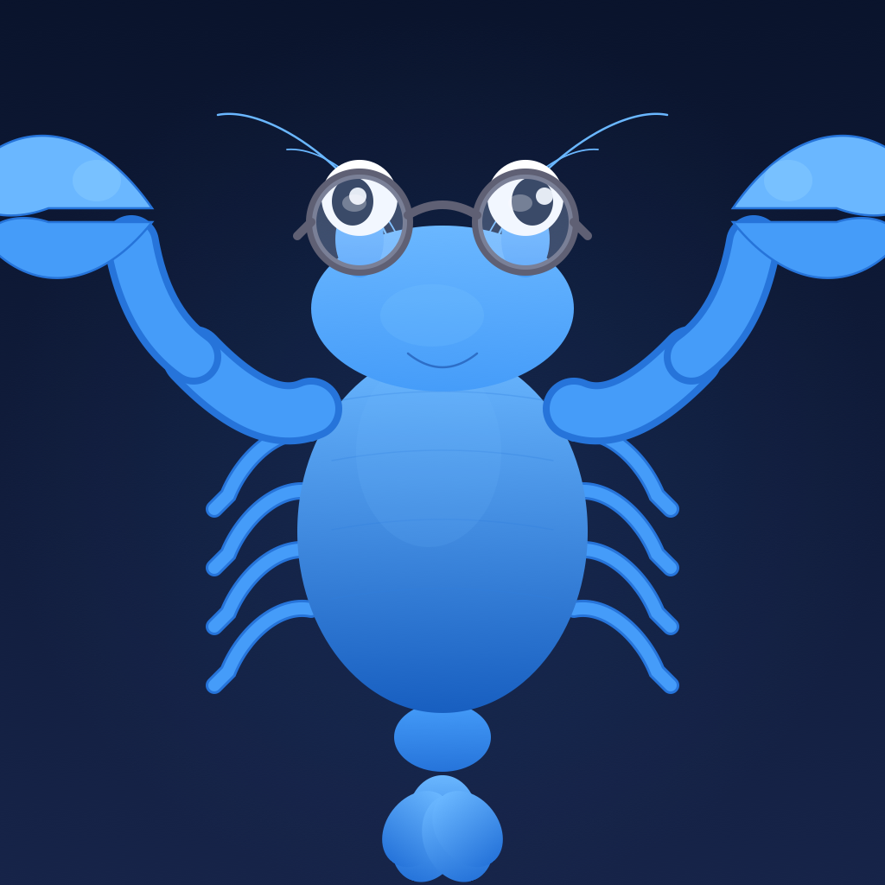
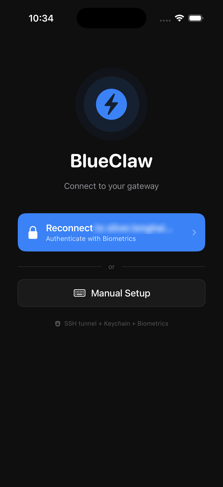
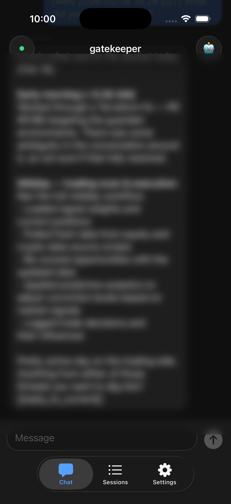
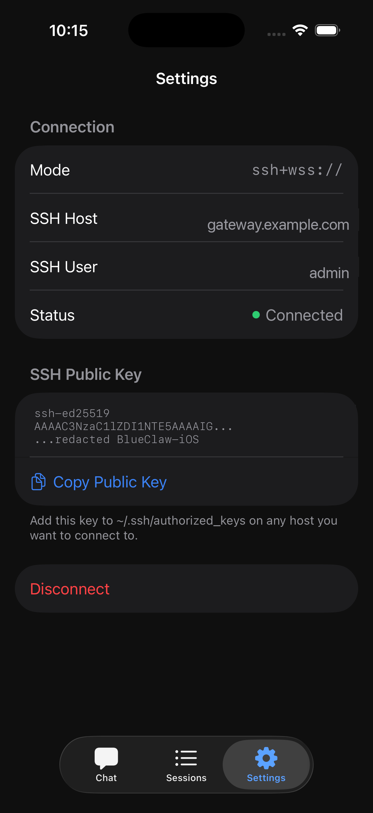

# BlueClaw

<p align="center">
  
</p>

BlueClaw is a native iOS client for [OpenClaw](https://github.com/priceconsulting/openclaw) gateways. It provides a mobile chat interface to interact with AI agents running on your self-hosted OpenClaw server, with secure connectivity via SSH tunneling or direct WebSocket connections.

## Features

- **Chat with AI agents** -- Full conversation interface with markdown rendering and multiple agent support
- **Session management** -- View, switch between, and manage active gateway sessions
- **Secure SSH tunneling** -- Connect to gateways behind firewalls via Ed25519 SSH key authentication with TOFU host key verification
- **Direct WebSocket** -- Connect directly to gateways with automatic TLS upgrade for non-local connections
- **QR code setup** -- Scan a QR code from your gateway to configure the connection instantly
- **Biometric authentication** -- Protect saved credentials with Face ID or Touch ID
- **Device identity** -- Ed25519 keypair stored in the iOS Keychain for cryptographic device authentication

## Screenshots

<p align="center">
  
  &nbsp;
  
  &nbsp;
  
</p>

## Requirements

- iOS 18.0+
- Xcode 26.2+
- An OpenClaw gateway server to connect to

## Building

1. Clone the repository
2. Open `BlueClaw.xcodeproj` in Xcode
3. SPM will automatically resolve the [Citadel](https://github.com/orlandos-nl/Citadel) SSH dependency
4. Build and run on a device or simulator

## Architecture

```
BlueClaw/
  Protocol/       # OpenClaw wire protocol types (frames, methods, connect params)
  Services/       # SSH tunneling, WebSocket, keychain, biometric auth
  ViewModels/     # App state, connection logic, chat view models
  Views/          # SwiftUI views (chat, sessions, connection setup, QR scanner)
  Theme/          # Color definitions
```

## License

Private -- all rights reserved.

Third-party dependencies are licensed under MIT and Apache 2.0. See [THIRD_PARTY_NOTICES](BlueClaw/THIRD_PARTY_NOTICES) for details.
